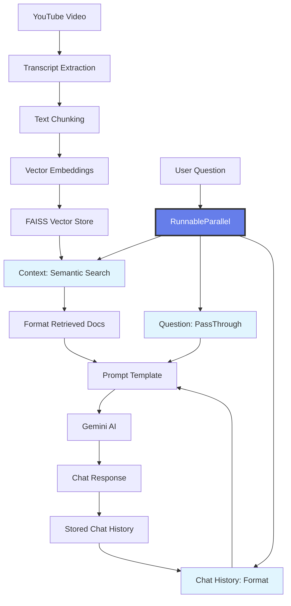

# 🎥 YouTube Video Chat Extension

> An intelligent chat interface that appears on YouTube videos, allowing you to have AI-powered conversations about the video content using advanced RAG (Retrieval-Augmented Generation) technology.


## ✨ Features

### 🎯 **Smart Video Analysis**
- **Automatic Transcript Processing**: Extracts and processes YouTube video transcripts
- **Context-Aware Responses**: AI understands and responds based on actual video content
- **Intelligent Chunking**: Breaks down long videos into manageable pieces for better comprehension

### 💬 **Modern Chat Interface**
- **Beautiful UI Design**: Modern gradient design with smooth animations
- **Real-time Typing Indicators**: Shows when AI is processing your question
- **Persistent Chat History**: Maintains conversation context throughout the video
- **Mobile-Friendly**: Responsive design that works on all devices

### 🧠 **Advanced AI Capabilities**
- **RAG Technology**: Uses Retrieval-Augmented Generation for accurate responses
- **Multi-Model Support**: Powered by Google's Gemini AI
- **Vector Search**: FAISS-based semantic search for relevant content retrieval
- **Context Preservation**: Remembers previous conversation for coherent discussions

---

## 🏗️ Architecture



### **Tech Stack**
- **Frontend**: Vanilla JavaScript with modern CSS
- **Backend**: Flask + Python
- **AI Models**: Google Gemini AI
- **Embeddings**: HuggingFace Sentence Transformers
- **Vector Store**: FAISS
- **Framework**: LangChain for RAG pipeline

---

## 🚀 Quick Start

### Prerequisites
- Python 3.8+
- Google API Key (for Gemini)
- Modern web browser
- YouTube videos with available transcripts

### 1. **Backend Setup**

```bash
# Clone the repository
git clone <your-repo-url>
cd youtube-chat-extension

# Install dependencies
pip install -r requirements.txt

# Set environment variables
export GOOGLE_API_KEY="your-gemini-api-key"
export GEMINI_MODEL="gemini-pro"  # or gemini-1.5-flash

# Run the Flask server
python app.py
```

### 2. **Frontend Integration**

**Option A: Browser Extension (Recommended)**
1. Create a new browser extension
2. Add the JavaScript code to your content script
3. Load the extension in developer mode

**Option B: Userscript**
1. Install Tampermonkey or Greasemonkey
2. Create a new userscript with the provided JavaScript
3. Enable the script for YouTube domains

**Option C: Browser Console**
1. Open YouTube video
2. Open browser developer tools (F12)
3. Paste the JavaScript code in console
4. Press Enter to activate

---

## 🎮 Usage

### **Starting a Conversation**

1. **Navigate** to any YouTube video
2. **Look** for the floating "💬 Chat about this video" button (top-right)
3. **Click** the button to open the chat interface
4. **Start chatting** about the video content!

### **Example Conversations**

```
👤 You: What is the main topic of this video?
🤖 AI: Based on the transcript, this video discusses machine learning fundamentals, specifically covering neural networks and deep learning concepts.

👤 You: Can you explain the part about backpropagation?
🤖 AI: The video explains backpropagation as the process where the neural network learns by calculating errors and adjusting weights backward through the network layers...
```

### **Chat Features**

| Feature | Description |
|---------|-------------|
| 🎯 **Context-Aware** | AI responds based on actual video content |
| 💭 **Memory** | Remembers previous questions in the conversation |
| ⚡ **Real-time** | Instant responses with typing indicators |
| 🎨 **Beautiful UI** | Modern design with smooth animations |
| 📱 **Responsive** | Works on desktop and mobile devices |

---

## ⚙️ Configuration

### **Environment Variables**

```bash
# Required
GOOGLE_API_KEY=your-gemini-api-key-here
GEMINI_MODEL=gemini-pro

# Optional
FLASK_ENV=development
FLASK_DEBUG=True
```

### **Model Customization**

```python
# In app.py, you can customize:

# Embedding model
EMBEDDING_MODEL_NAME = "sentence-transformers/all-MiniLM-L6-v2"

# Chunk settings
chunk_size = 1000
chunk_overlap = 200

# Retrieval settings
search_kwargs = {"k": 2}  # Number of relevant chunks to retrieve
```

### **UI Customization**

```javascript
// In the JavaScript file, customize:

// Button position
top: 100px;
right: 20px;

// Chat box size
width: 380px;
height: 500px;

// Color scheme
background: linear-gradient(135deg, #667eea 0%, #764ba2 100%);
```

---

## 🔧 API Reference

### **Chat Endpoint**

```http
POST /chat
Content-Type: application/json

{
  "video_id": "dQw4w9WgXcQ",
  "message": "What is this video about?"
}
```

**Response:**
```json
{
  "response": "This video is about..."
}
```

### **Health Check**

```http
GET /health
```

**Response:**
```json
{
  "status": "ok"
}
```

---

## 🛠️ Development

### **Project Structure**

```
youtube-chat-extension/
├── 📄 app.py                 # Flask backend server
├── 📄 content-script.js      # Frontend chat interface
├── 📄 requirements.txt       # Python dependencies
├── 📄 README.md             # This file
└── 📁 assets/               # Images and demos
```

### **Key Components**

1. **Transcript Processing**: Extracts and chunks YouTube transcripts
2. **Vector Store**: Creates searchable embeddings using FAISS
3. **RAG Pipeline**: Retrieves relevant context and generates responses
4. **Chat Interface**: Modern UI for seamless user interaction
5. **Memory Management**: Maintains conversation history per video

---

## 🚨 Troubleshooting

### **Common Issues**

| Issue | Solution |
|-------|----------|
| 🚫 "No transcript available" | Video doesn't have captions - try another video |
| 🔌 "Connection error" | Ensure Flask server is running on localhost:5000 |
| 🔑 "API key error" | Check your Google API key is valid and set correctly |
| 💾 "Memory issues" | Restart the server to clear chat history |

### **Debug Mode**

```bash
# Enable debug logging
export FLASK_DEBUG=True
python app.py

# Check server logs for detailed error information
```

---

## 🤝 Contributing

We welcome contributions! Here's how you can help:

1. **🍴 Fork** the repository
2. **🌿 Create** a feature branch (`git checkout -b feature/amazing-feature`)
3. **💬 Commit** your changes (`git commit -m 'Add amazing feature'`)
4. **📤 Push** to the branch (`git push origin feature/amazing-feature`)
5. **🔀 Open** a Pull Request

### **Development Guidelines**

- Follow PEP 8 for Python code
- Use meaningful commit messages
- Add tests for new features
- Update documentation as needed

---

## 🙏 Acknowledgments

- **🤖 Google Gemini AI** - For powerful language understanding
- **🤗 HuggingFace** - For sentence transformers
- **🦜 LangChain** - For RAG framework
- **📺 YouTube** - For transcript API access
- **🎨 CSS Gradients** - For beautiful UI design

---


<div align="center">

**⭐ Star this repo if you found it helpful! ⭐**

Made with ❤️ by Aayush Raj Pokhrel

</div>
